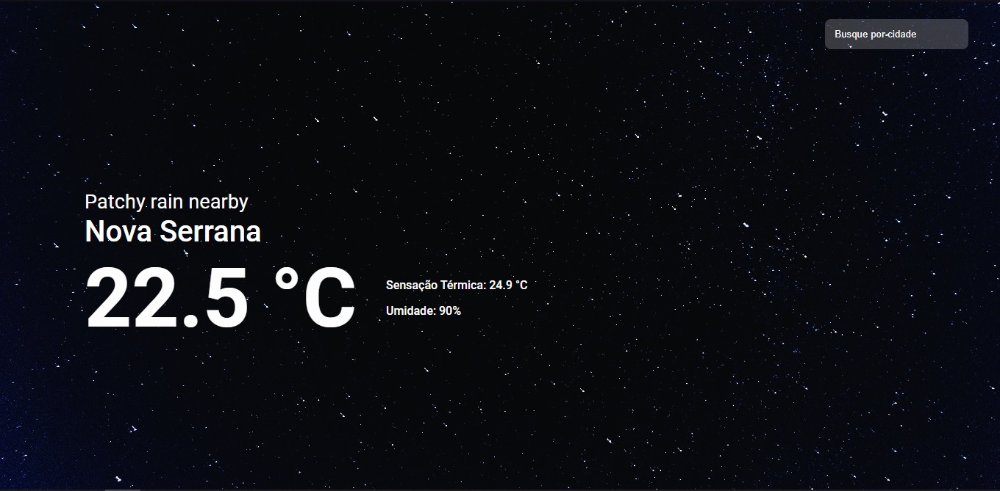

<h1 align="center"> Previsão do Tempo </h1>

Aplicação para buscar a previsão do tempo.

  <a href="#-tecnologias">Tecnologias</a>&nbsp;&nbsp;&nbsp;&nbsp;&nbsp;|&nbsp;&nbsp;&nbsp;
  <a href="#memo-licença">Licença</a>

  

 

  

## 🚀 Tecnologias

Esse projeto foi desenvolvido com as seguintes tecnologias:

- HTML
- CSS
- JavaScript
- API

## 📝 Licença

Esse projeto está sob a licença MIT.